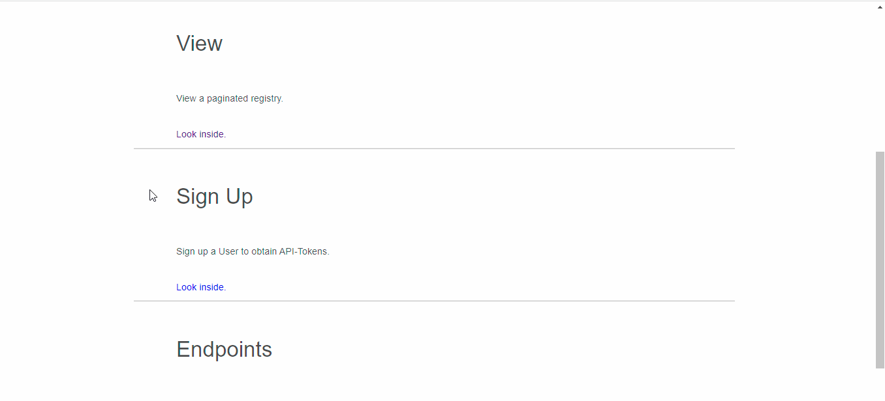
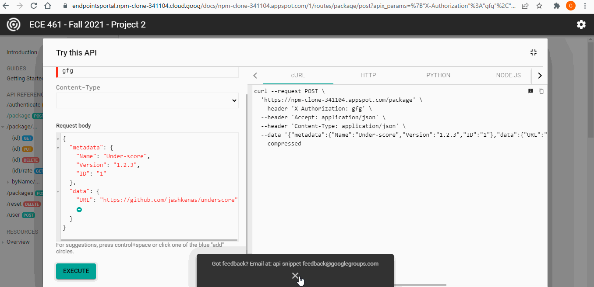
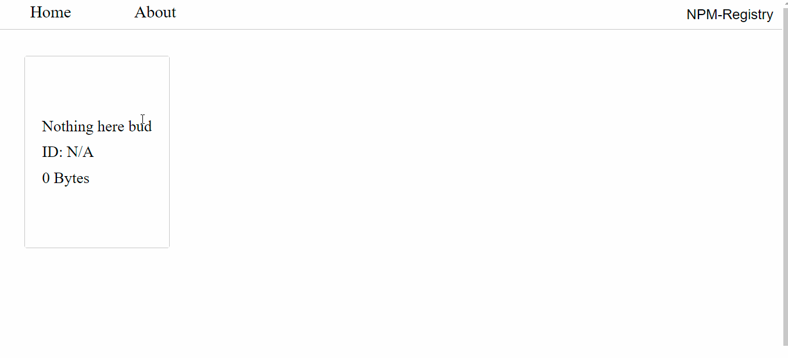
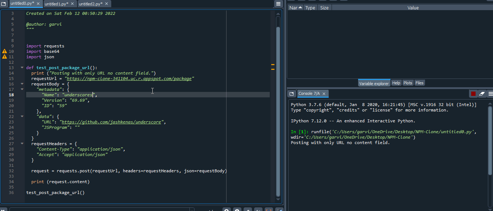

# NPM Clone
This project is a NPM-registry with authentication. 

# Description
This project was made by me and another contributor.   For a detailed commit history check here: https://github.com/Purdue-ECE-461/project-2-project-2-19.

# Link
https://npm-clone-341104.uc.r.appspot.com/

# View

   
   

   
   

   

   

# Deployment
$ gcloud app deploy
